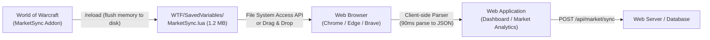

# MarketSync External Data Extraction & Web Import Guide

This guide explains how external web services, websites, and browser extensions can extract Auction House data directly from MarketSync **without requiring users to download or run any external desktop applications**.

---

## 1. Why Avoid In-Game Clipboard Copying?

In World of Warcraft, an active Auction House catalog with 2,000 to 30,000+ item variants and price history reaches **1.5 MB – 12 MB** of structured Lua data (75,000 to 250,000+ lines in `MarketSyncDB.lua`). 
WoW's native `EditBox` is safely limited to ~12 KB per frame to avoid client freezes and clipboard buffer truncation. Attempting to copy a mature database would require **between 120 and over 400 manual copy-paste cycles**.

Instead, MarketSync automatically persists its complete, high-fidelity database to disk in the game's `SavedVariables` directory. External systems can read this file directly.

---

## 2. File Location & WoW Lifecycle

### File Path
On the player's computer, MarketSync's data lives at:
- **Windows (Standard)**:
  `C:\Program Files (x86)\World of Warcraft\<flavor>\WTF\Account\<AccountID>\SavedVariables\MarketSync.lua`
- **Windows (Custom Drive)**:
  `<WoW_Install_Dir>\<flavor>\WTF\Account\<AccountID>\SavedVariables\MarketSync.lua`
- **macOS**:
  `/Applications/World of Warcraft/<flavor>/WTF/Account/<AccountID>/SavedVariables/MarketSync.lua`

*(Where `<flavor>` is `_classic_beta_`, `_classic_era_`, `_classic_`, or `_retail_`)*.

### WoW Flush Lifecycle
> [!IMPORTANT]
> World of Warcraft holds addon `SavedVariables` in live memory while the game is running. WoW flushes this memory to `MarketSync.lua` on disk when:
> 1. The player runs `/reload` in chat (takes ~1.5 seconds).
> 2. The player logs out to the character selection screen.
> 3. The player cleanly exits the game.
>
> If the player scans the AH, they simply type `/reload` (or click a reload button) to commit the latest data to disk.

---

## 3. Extraction Methods (Ranked from Simplest to Most Automated)

### Method 1: Web File System Access API (Recommended — Zero Downloads, 1-Click Sync)
Modern Chromium browsers (Google Chrome, Microsoft Edge, Brave, Opera) support the **File System Access API**. 
A website can prompt the user to select their `MarketSync.lua` file **once**, save the permission handle in browser `IndexedDB`, and re-read the updated file with one click whenever the user visits the site.

#### Browser Client Code (HTML + JavaScript):
```html
<button id="btnConnect">Connect MarketSync</button>
<button id="btnSync" style="display:none;">Sync Latest Prices</button>
<div id="status"></div>

<script type="module">
  import { parseMarketSyncSavedVariables } from './marketsync-parser.js';

  let fileHandle = null;

  // 1. User selects file ONCE
  document.getElementById('btnConnect').addEventListener('click', async () => {
    try {
      [fileHandle] = await window.showOpenFilePicker({
        types: [{
          description: 'MarketSync SavedVariables',
          accept: { 'text/plain': ['.lua'] }
        }],
        multiple: false
      });
      document.getElementById('btnSync').style.display = 'inline-block';
      document.getElementById('status').innerText = 'Connected to MarketSync.lua!';
      await syncData();
    } catch (err) {
      console.warn('File picker cancelled or unsupported', err);
    }
  });

  // 2. Click "Sync" anytime to read fresh data from disk
  document.getElementById('btnSync').addEventListener('click', syncData);

  async function syncData() {
    if (!fileHandle) return;
    const file = await fileHandle.getFile();
    const text = await file.text();
    
    // Parse in ~90ms directly in the browser
    const db = parseMarketSyncSavedVariables(text);
    console.log('Successfully extracted MarketSync database:', db);
    document.getElementById('status').innerText = 
      `Synced ${Object.keys(db.items).length} items from ${db.realm}! Last scan: ${new Date(db.scanTime * 1000).toLocaleString()}`;
    
    // Send clean JSON to your backend API
    await fetch('/api/market/upload', {
      method: 'POST',
      headers: { 'Content-Type': 'application/json' },
      body: JSON.stringify(db)
    });
  }
</script>
```

---

### Method 2: Drag & Drop File Upload (Works on 100% of Browsers)
For browsers that do not support the File System Access API (such as Firefox or Safari on iOS), provide a standard file dropzone:
- User drags `MarketSync.lua` into the browser window.
- Handled via standard `<input type="file" accept=".lua">` or `dragover`/`drop` events.
- Client-side `FileReader.readAsText(file)` reads the 1.2 MB file in **under 15 ms**.

---

### Method 3: Lightweight Chrome Extension
If you prefer a browser extension:
- A Chrome Extension (Manifest V3) can be installed from the Web Store in 1 click.
- It can provide a dedicated toolbar popup:
  - *"Select WTF Folder"*
  - *"Auto-sync every 15 minutes"*
- The extension can use `chrome.storage.local` to store state and POST updates to your web service in the background.

---

## 4. `MarketSync.lua` Data Schema

The SavedVariables file contains a global table `MarketSyncDB`. The key sections are:

```
MarketSyncDB
├── ItemInfoCache               [Global item metadata cache]
│   └── [itemID] = { n, r, i, c, s, ic, m }
│
└── RealmData
    └── ["<RealmName>"]         [e.g. "ClassicBetaPvP2"]
        ├── PersonalScanTime    [Unix timestamp of last personal scan]
        ├── FullScanTime        [Unix timestamp of last complete AH scan]
        ├── LatestBucket        [Latest 30-min bucket index]
        │
        ├── PersonalData        [Main Auction House price records]
        │   └── ["<itemKey>"] = {
        │           m: <unit_buyout_copper>,
        │           d: <scan_day_number>,
        │           observedAt: <unix_seconds>,
        │           latestBucket: <bucket_id>,
        │           q: <quantity_available>,
        │           h: { ["<day>"]: "<offset>:<b36price>:<b36qty>,..." },
        │           vh: { ... }
        │       }
        │
        └── NeutralData         [Neutral AH price records]
```

### Key Field Reference:
| Field | Type | Description |
| :--- | :--- | :--- |
| `itemKey` | String | Item identifier. Either plain item ID (e.g. `"4471"`) or variant key (e.g. `"p:4471:12"` for random enchantment suffix). |
| `m` | Integer | Minimum buyout price in **copper per unit** (e.g. `800` = 8 silver, `154500` = 15g 45s). |
| `d` | Integer | Provider scan day number (Unix day on Forever). |
| `observedAt` | Integer | Exact Unix timestamp in seconds when the auction was observed. |
| `q` | Integer | Available quantity on the auction house. |
| `ItemInfoCache[id].n` | String | Item localized name (e.g. `"Blackrock Pauldrons"`). |
| `ItemInfoCache[id].r` | Integer | Item rarity/quality (0=Poor, 1=Common, 2=Uncommon, 3=Rare, 4=Epic, 5=Legendary). |
| `ItemInfoCache[id].i` | Integer | Item level. |
| `ItemInfoCache[id].ic` | Integer | Blizzard icon file ID. |

---

## 5. Production Parsers (Tested on Real 1.26 MB MarketSync.lua)

### A. TypeScript / Modern JavaScript Parser (Node.js & Browser)
*Performance: Parses a 1.26 MB file (75,000+ lines, 2,200+ items) in **~90 milliseconds**.*

```typescript
// marketsync-parser.ts
import * as luaparse from 'luaparse';

export interface MarketItemSummary {
  key: string;
  itemId: number;
  suffixId: number;
  name: string;
  quality: number;
  itemLevel: number;
  iconId: number;
  marketPriceCopper: number;
  observedAt: number;
  scanDay: number;
}

export interface ExtractedRealmMarket {
  realm: string;
  personalScanTime: number;
  fullScanTime: number;
  itemCount: number;
  items: Record<string, MarketItemSummary>;
}

function parseLuaNode(node: any): any {
  if (!node) return null;
  switch (node.type) {
    case 'StringLiteral':
      return node.raw ? JSON.parse(node.raw) : node.value;
    case 'NumericLiteral':
    case 'BooleanLiteral':
      return node.value;
    case 'NilLiteral':
      return null;
    case 'UnaryExpression':
      return node.operator === '-' ? -parseLuaNode(node.argument) : parseLuaNode(node.argument);
    case 'TableConstructorExpression': {
      const obj: Record<string, any> = {};
      let isArray = true;
      const arr: any[] = [];
      for (const field of node.fields) {
        if (field.type === 'TableKeyString' || field.type === 'TableKey') {
          isArray = false;
          obj[parseLuaNode(field.key)] = parseLuaNode(field.value);
        } else if (field.type === 'TableValue') {
          arr.push(parseLuaNode(field.value));
        }
      }
      return isArray && arr.length > 0 ? arr : obj;
    }
    default:
      return null;
  }
}

export function parseMarketSyncSavedVariables(luaContent: string): Record<string, ExtractedRealmMarket> {
  const ast = luaparse.parse(luaContent);
  const rootStatement = ast.body.find(
    (stmt: any) => stmt.type === 'AssignmentStatement' && stmt.variables[0]?.name === 'MarketSyncDB'
  );
  if (!rootStatement) throw new Error('MarketSyncDB table not found in file');

  const rawDB = parseLuaNode((rootStatement as any).init[0]);
  const itemCache = rawDB.ItemInfoCache || {};
  const realms: Record<string, ExtractedRealmMarket> = {};

  for (const [realmName, realmData] of Object.entries<any>(rawDB.RealmData || {})) {
    const personalData = realmData.PersonalData || {};
    const items: Record<string, MarketItemSummary> = {};

    for (const [key, entry] of Object.entries<any>(personalData)) {
      if (!entry || typeof entry.m !== 'number') continue;

      let itemId = parseInt(key, 10);
      let suffixId = 0;
      if (key.startsWith('p:')) {
        const parts = key.split(':');
        itemId = parseInt(parts[1], 10);
        suffixId = parseInt(parts[2], 10);
      }

      const meta = itemCache[itemId] || {};
      items[key] = {
        key,
        itemId,
        suffixId,
        name: meta.n || `Item ${itemId}`,
        quality: meta.r ?? 1,
        itemLevel: meta.i ?? 0,
        iconId: meta.ic ?? 0,
        marketPriceCopper: entry.m,
        observedAt: entry.observedAt || 0,
        scanDay: entry.d || 0,
      };
    }

    realms[realmName] = {
      realm: realmName,
      personalScanTime: realmData.PersonalScanTime || 0,
      fullScanTime: realmData.FullScanTime || 0,
      itemCount: Object.keys(items).length,
      items,
    };
  }

  return realms;
}
```

---

### B. Python Backend Parser (FastAPI / Django)
```python
# marketsync_parser.py
import re
from typing import Dict, Any

def parse_marketsync_lua(file_content: str) -> Dict[str, Any]:
    """
    Fast extraction of RealmData and ItemInfoCache from MarketSync.lua
    without requiring external C-based Lua runtimes.
    """
    # 1. Extract Item Info Cache (id -> name, quality, icon)
    item_cache = {}
    cache_match = re.search(r'\["ItemInfoCache"\]\s*=\s*\{(?P<body>.*?)\n\s*\},', file_content, re.DOTALL)
    if cache_match:
        for block in re.finditer(r'\[(?P<id>\d+)\]\s*=\s*\{(?P<fields>.*?)\},', cache_match.group('body'), re.DOTALL):
            item_id = int(block.group('id'))
            name_m = re.search(r'\["n"\]\s*=\s*"(?P<n>[^"]+)"', block.group('fields'))
            qual_m = re.search(r'\["r"\]\s*=\s*(?P<r>\d+)', block.group('fields'))
            icon_m = re.search(r'\["ic"\]\s*=\s*(?P<ic>\d+)', block.group('fields'))
            item_cache[item_id] = {
                "name": name_m.group('n') if name_m else f"Item {item_id}",
                "quality": int(qual_m.group('r')) if qual_m else 1,
                "icon": int(icon_m.group('ic')) if icon_m else 0,
            }

    # 2. Extract PersonalData per Realm
    realms = {}
    realm_blocks = re.finditer(
        r'\["(?P<realm>[^"]+)"\]\s*=\s*\{.*?'
        r'\["PersonalScanTime"\]\s*=\s*(?P<scan_time>\d+).*?'
        r'\["PersonalData"\]\s*=\s*\{(?P<pdata>.*?)\n\s*\},',
        file_content,
        re.DOTALL
    )

    for rb in realm_blocks:
        realm_name = rb.group('realm')
        scan_time = int(rb.group('scan_time'))
        pdata_str = rb.group('pdata')

        items = {}
        for item_match in re.finditer(
            r'\["(?P<key>[^"]+)"\]\s*=\s*\{[^}]*?'
            r'\["m"\]\s*=\s*(?P<price>\d+)[^}]*?'
            r'\["d"\]\s*=\s*(?P<day>\d+)',
            pdata_str
        ):
            key = item_match.group('key')
            price = int(item_match.group('price'))
            day = int(item_match.group('day'))
            
            item_id = int(key.split(':')[1]) if key.startswith('p:') else int(key)
            meta = item_cache.get(item_id, {})

            items[key] = {
                "key": key,
                "item_id": item_id,
                "name": meta.get("name", f"Item {item_id}"),
                "quality": meta.get("quality", 1),
                "price_copper": price,
                "scan_day": day,
            }

        realms[realm_name] = {
            "realm": realm_name,
            "scan_time": scan_time,
            "item_count": len(items),
            "items": items,
        }

---

## 6. Decoding Granular Price History (`h` & `vh`)

For systems that want to render intraday price graphs or track historical volatility, MarketSync encodes history points in a compact format:

### A. Hot Tier (Days 0–7): 30-Minute Price Points
```text
"12:m8:0,16:m8:17"
```
Comma-separated list of `<bucketOffset>:<base36Price>:<base36Quantity>`:
- **`bucketOffset`** (0–47): 30-minute interval within that scan day (`offset * 1800` seconds from the start of the day). E.g. offset `12` is $12 \times 30\text{ min} = 6:00\text{ AM}$.
- **`base36Price`**: Copper price encoded in base 36 (`parseInt("m8", 36) = 800` copper = 8 silver).
- **`base36Quantity`**: Units available (`parseInt("17", 36) = 43` units).

### B. Warm Tier (Days 8–30): Daily Summaries
```text
"D:min:max:avg:vol"
```
All four fields are in base 36 copper / units. Prefix `D` indicates daily aggregated metrics.

### C. Cold Tier (Days 31–180): Weekly Summaries
```text
"W:min:max:avg:vol"
```
All four fields are in base 36 copper / units. Prefix `W` indicates weekly aggregated metrics (keyed by week, e.g. `["W2960"]`).

#### Quick JavaScript Decoder Snippet:
```javascript
function decodeHistoryString(histStr, dayTimestamp) {
  if (!histStr) return [];
  if (histStr.startsWith('D:') || histStr.startsWith('W:')) {
    const [, min, max, avg, vol] = histStr.split(':');
    return [{
      type: histStr[0] === 'D' ? 'daily' : 'weekly',
      min: parseInt(min, 36),
      max: parseInt(max, 36),
      avg: parseInt(avg, 36),
      volume: parseInt(vol, 36)
    }];
  }

  // 30-minute granular points
  return histStr.split(',').map(token => {
    const [offset, pB36, qB36] = token.split(':');
    return {
      type: 'point',
      timestamp: dayTimestamp + (parseInt(offset, 10) * 1800),
      price: parseInt(pB36, 36),
      quantity: parseInt(qB36, 36)
    };
  });
}
```

---

## 7. Summary: The Recommended Zero-Download Architecture



1. **Player Experience**:
   - Player finishes scan in game $\to$ types `/reload`.
   - On the website, clicks **"Sync Latest Prices"** (connected once via the browser's native File System Access API).
   - Zero software to download, no `.exe`, no extensions, no 12 KB copy-paste boxes.
2. **Server Experience**:
   - Receives clean, strongly typed JSON payloads with exact item names, qualities, and copper prices ready for database indexing.
